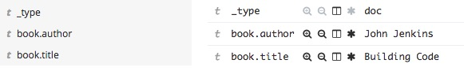
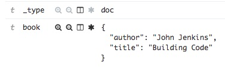
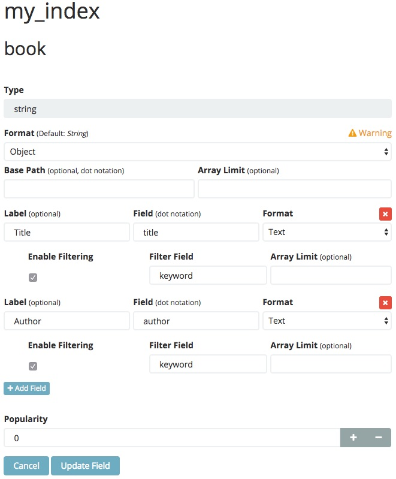
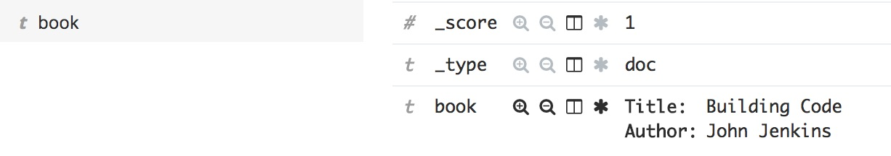
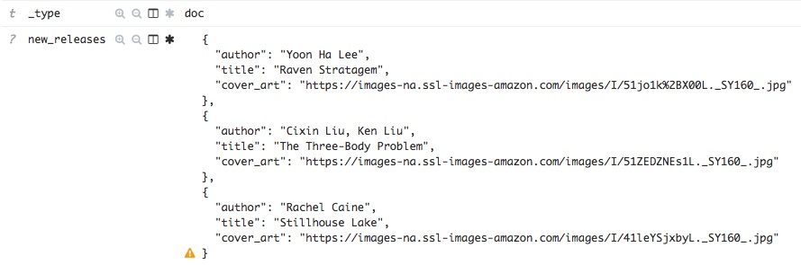
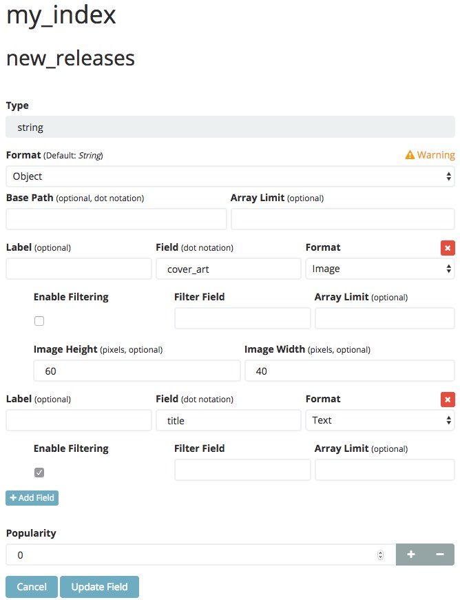
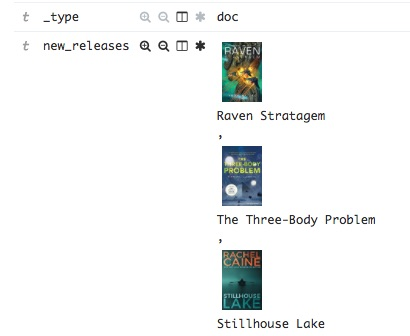

# kibana_object_format

This Kibana plugin enables you to configure field formatters for arrays of objects in the Discover tab and Search tables in dashboards.


---

## Features

 - Kibana 5.x compatible
 - Enables field formatting for objects and arrays of objects
 - Includes a general purpose Object field formatter to fit most needs with:
    - Hit highlighting
    - Cell click filtering
    - Support for Text, Hyperlinks, and Images

## How it works

Kibana has long needed a good way to display arrays of objects in the discover tab. What you get from Kibana is a json string representation of the data and a warning icon stating that, "Objects in arrays are not well supported". The reason for this is that Elasticsearch doesn't care or store in the index mapping that your field is an array of objects. The index mapping is a flattened view of the data. 


Looking at the fields list on the Index Patterns tab reveals this as well. You will find entries for all of the concrete values of your object, but nothing for the containing object. This plugin allows you to create synthetic entries in the fields list. Once an entry for the path you want to display is available in the list, you can apply any field formatter to it, and the Discover table will use that to display the value. 

## Instructions

 1. Install the plugin following Kibana's [official documentation](https://www.elastic.co/guide/en/kibana/current/_installing_plugins.html).

 2. Configure the index pattern to include the additional field(s).
 
    The plugin adds a new property to the *Advanced Settings* table named **fieldMapperHack:fields**. The value is a JSON object which defines include and exclude lists per index pattern. The include and exclude lists values can be regular expressions, and are applied include first then excludes second.
    
    If the index pattern key is named '__\*__', this entry will be used as the default for all index patterns that a specific entry is not defined. In the example JSON below, all index patterns are ignored except for one named *my_index_pattern*. For this index pattern we inject a field entry into the list for the field located at *my.field*.

    ```json
    {
        "index_pattern":{
            "*":{
                "include":[
    
                ],
                "exclude":[
                    ".*"
                ]
            },
            "my_index_pattern":{
                "include":[
                    "my.field"
                ]
            }
        }
    }
    ```

 3. Refresh the fields list for your index pattern.
    
    

 4. Select a field formatter for the new field entry!

## Examples

#### Formatting a Basic Object

Data Sample:

```json
{
  "book": {
    "author": "John Jenkins",
    "title": "Building Code"
  }
}
```
Index Mapping:
```json
{
  "my_index": {
    "mappings": {
      "doc": {
        "properties": {
          "book": {
            "properties": {
              "author": {
                "type": "text",
                "fields": {
                  "keyword": {
                    "type": "keyword",
                    "ignore_above": 256
                  }
                }
              },
              "title": {
                "type": "text",
                "fields": {
                  "keyword": {
                    "type": "keyword",
                    "ignore_above": 256
                  }
                }
              }
            }
          }
        }
      }
    }
  }
}
```

Indexing the above document into an index named *my_index* will yield the following in the discover tab.



As a trivial example, we can display the whole _book_ object as a single item in the discover tab and choose which of it's fields to include. To do this, we must inject a field into the fields list by editing the **fieldMapperHack:fields** advanced configuration to include our index mapping and field, as seen below.

```json
{
   "index_pattern":{
      "*":{
         "include":[

         ],
         "exclude":[
            ".*"
         ]
      },
      "my_index":{
         "include":[
            "book"
         ]
      }
   }
}
```
Next we must *Refresh* the field list for the index pattern. This will add a new field entry for the *book* object. Because of this new field, the Discover tab will change the presentation from the two previous fields and only show the book field as a json object.



Seeing the *book* object as JSON in the Discover tab is not exactly a desirable result. But it demonstrates the basic behavior this plugin leverages to synthesize field entries so that we can apply a field formatter. 

Lets return to the fields list for our *my_index* index pattern and apply the *Object* field formatter to it. Then lets configure the formatter so that we get a nice non-json view of the object.



Now let's go back to the Discover tab and see the results.



The usefulness of this particular example is likely low, beyond demonstrating the basic steps of configuration. Next let's look at a more advanced scenario.

#### Formatting an Array of Objects

Data Sample:
```json
{
   "new_releases":[
      {
         "author":"Yoon Ha Lee",
         "title":"Raven Stratagem",
         "cover_art":"https://images-na.ssl-images-amazon.com/images/I/51jo1k%2BX00L._SY160_.jpg"
      },
      {
         "author":"Cixin Liu, Ken Liu",
         "title":"The Three-Body Problem",
         "cover_art":"https://images-na.ssl-images-amazon.com/images/I/51ZEDZNEs1L._SY160_.jpg"
      },
      {
         "author":"Rachel Caine",
         "title":"Stillhouse Lake",
         "cover_art":"https://images-na.ssl-images-amazon.com/images/I/41leYSjxbyL._SY160_.jpg"
      }
   ]
}
```

Index Mapping:
```json
{
  "my_index": {
    "mappings": {
      "doc": {
        "properties": {
          "new_releases": {
            "properties": {
              "author": {
                "type": "text",
                "fields": {
                  "keyword": {
                    "type": "keyword",
                    "ignore_above": 256
                  }
                }
              },
              "cover_art": {
                "type": "text",
                "fields": {
                  "keyword": {
                    "type": "keyword",
                    "ignore_above": 256
                  }
                }
              },
              "title": {
                "type": "text",
                "fields": {
                  "keyword": {
                    "type": "keyword",
                    "ignore_above": 256
                  }
                }
              }
            }
          }
        }
      }
    }
  }
}
```

Indexing the above document into an index named *my_index* will yield the following in the discover tab.



Now edit the **fieldMapperHack:fields** advanced configuration:

```json
{
   "index_pattern":{
      "*":{
         "include":[

         ],
         "exclude":[
            ".*"
         ]
      },
      "my_index":{
         "include":[
            "new_releases"
         ]
      }
   }
}
```

Next we must *Refresh* the field list for the index pattern, and apply the *Object* field formatter to new *books.new_releases* field.



Now let's go back to the Discover tab and see the results.



---

## development

See the [kibana contributing guide](https://github.com/elastic/kibana/blob/master/CONTRIBUTING.md) for instructions setting up your development environment. Once you have completed that, use the following npm tasks.

  - `npm start`

    Start kibana and have it include this plugin

  - `npm start -- --config kibana.yml`

    You can pass any argument that you would normally send to `bin/kibana` by putting them after `--` when running `npm start`

  - `npm run build`

    Build a distributable archive

  - `npm run test:browser`

    Run the browser tests in a real web browser

  - `npm run test:server`

    Run the server tests using mocha

For more information about any of these commands run `npm run ${task} -- --help`.
