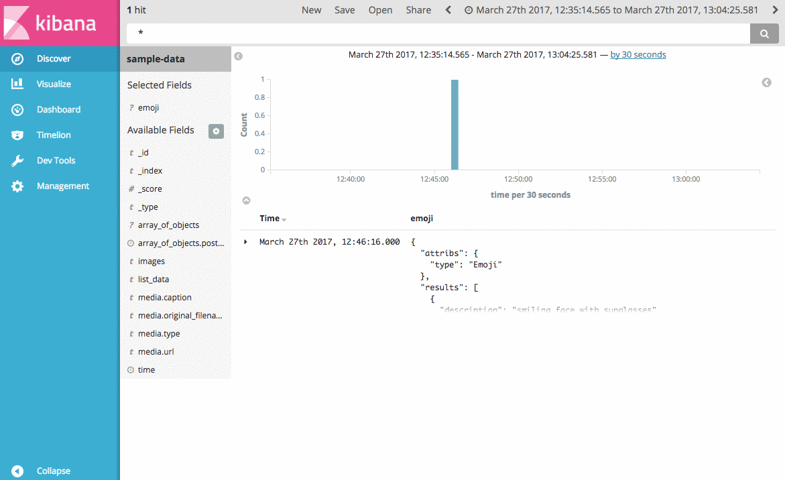
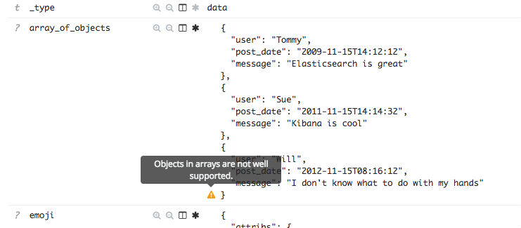
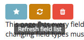

# kibana_object_viz

This Kibana plugin enables you to configure field formatters for arrays of objects in the Discover tab and Search tables in dashboards.



---

## Features

 - Kibana 5.x compatible
 - Enables field formatting for objects and arrays of objects
 - Includes a general purpose Object field formatter to fit most needs with:
    - Hit highlighting
    - Cell click filtering
    - Support for Text, Hyperlinks, and Images

## How it works

Kibana has long needed a good way to display arrays of objects in the discover tab. What you get from Kibana is a json string representation of the data and a warning icon stating that, "Objects in arrays are not well supported". The reason for this is that Elasticsearch doesn't care or store in the index mapping that your field is an array of objects. The index mapping is a flattened view of the data. 



Looking at fields list in the Index Patterns tab reveals this as well. You will find entries for all of the concrete values of your object, but nothing for the object or the possible array containing the object. This plugin allows you to create synthetic entries in the fields list. Once an entry for the path you want to display is available in the list, you can apply any field formatter to it, and the Discover table will use that to display the value. 

## Instructions

 1. Install the plugin following the [official documentation](https://www.elastic.co/guide/en/kibana/current/_installing_plugins.html).

 2. Configure the index pattern to include the fields.
 
    The plugin adds a new property to the *Advanced Settings* table named **fieldMapperHack:fields**. The value is a JSON object which defines include and exclude lists per index pattern. The include and exclude lists values can be regular expressions, and are applied include first then excludes second.
    
    The index pattern can be named '__\*__', and this entry will be used as the default for all indexe patterns if a specific entry is not defined.

    ```json
    {
        "index_pattern":{
            "*":{
                "include":[
    
                ],
                "exclude":[
                    ".*"
                ]
            },
            "my_index_pattern":{
                "include":[
                    "^my.field$"
                ]
            }
        }
    }
    ```

 3. Refresh the fields list for your index pattern.
    
    

 4. Select a field formatter for the new field entry!

---

## development

See the [kibana contributing guide](https://github.com/elastic/kibana/blob/master/CONTRIBUTING.md) for instructions setting up your development environment. Once you have completed that, use the following npm tasks.

  - `npm start`

    Start kibana and have it include this plugin

  - `npm start -- --config kibana.yml`

    You can pass any argument that you would normally send to `bin/kibana` by putting them after `--` when running `npm start`

  - `npm run build`

    Build a distributable archive

  - `npm run test:browser`

    Run the browser tests in a real web browser

  - `npm run test:server`

    Run the server tests using mocha

For more information about any of these commands run `npm run ${task} -- --help`.
